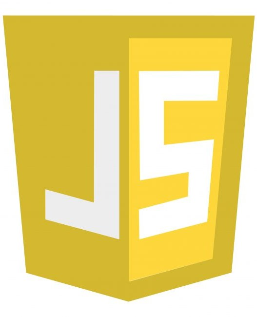

<!--
**shahdmadhoun/shahdmadhoun** is a ✨ _special_ ✨ repository because its `README.md` (this file) appears on your GitHub profile.

Here are some ideas to get you started:

- 🔭 I’m currently working on ...
- 🌱 I’m currently learning ...
- 👯 I’m looking to collaborate on ...
- 🤔 I’m looking for help with ...
- 💬 Ask me about ...
- 📫 How to reach me: ...
- 😄 Pronouns: ...
- ⚡ Fun fact: ...

-->

<h1 align="center">Hi there 👋, I'm Shahd</h1>
<h3 align="center">I'm A software development</h3>

- 🌱 4th year Computer Science student

- ⚡ Get in touch at: shahdem100@gmail.com

### Connect with me:

&nbsp;&nbsp;

&nbsp;&nbsp;

&nbsp;&nbsp;

### Languages and Tools:

 
 

---
---